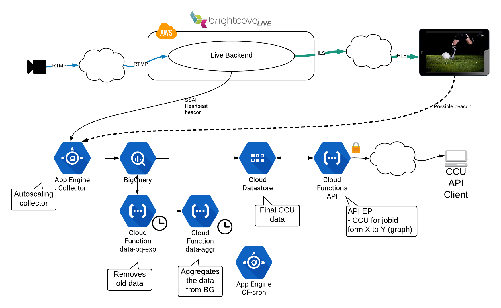

# brighcove-live-ssai-ccu
This project is just a POC (proof of concept) to show a possible way to calculate the **real time** CCU (concurrent viewers) of any web resource, but it is focused to video streams.
This code works out of the box for any Brightcove live stream with SSAI (Server Side Ad Insertion) active. The code can also receive analytics client side (from the player) and offer a data comparison (server side vs client side)
If you want to use also client side data you should implement a player side plug-in and send a beacon (HTTP[s] GET) to the following address every 1min (or less) during playback, recommended to send it every 30s. For [video-js](https://videojs.com/) is enough implementing a simple plug-in that sends that beacon info.
```
http://GCP_PROJECT_NAME.appspot.com/GUID/JOBID/SESSIONID/ACCOUNTID/EPOCH_S/csheartbeat
```
Test example:
```
curl http://myGCPProject-001.appspot.com/242bbf588a574e018de94136a664cfaf/142bbf588a574e018de94136a664cfaf/142bbf588a574e018de94136a664cfbc/123456789/1534640088/csheartbeat
```
IMPORTANT NOTE: This project is creating resources on the user's GCP (Google Cloud Platform), if you measure CCU of high audiences streams you can incur in high GCP costs.

# Block diagram
//TODO: JOC


1. The collectors receives the beacons from the field, those beacons can be sent from the Brightcove live backend (see example in [Deployment](#Deployment)), or from the player (needs some simple code there). Those collectors autoscales pretty quick according to appEngine default config.
2. The collectors sends almost instantaneously the beacons to a BigQuery table.
3. Every 1min the cloud function [cf-dataaggr](/cf-dataaggr) is called and queries BigQuery table and calculates the CCU data per jobid for last 30 minutes, aggregating this data in 1 minute slots (resolution). Finally inserts the results to GCP Datastore table.
4. Every 1min the cloud function [cf-databqexp](/cf-databqexp) is called and removes data older than 1h on the BigQuery beacons table, keeping this table size as small.

# Deployment
1. Clone this repo:
```
git@github.com:jordicenzano/brighcove-live-ssai-ccu.git
```

2. Copy the config file `cp ./config/config.vars.example cp ./config/config.vars`, and use any text editor to fill out the values in `./config/config.vars`

3. Copy the secrets file `cp ./secrets/secrets.vars.example cp ./secrets/secrets.vars`, and use any text editor to fill out the values in `./secrets/secrets.vars`

4. Execute the GCP deployment script (you will be prompted to answer few questions). We are assuming you already have a GCP account
```
./GCP_deploy.sh
```
3. As a result of the previous script you should write down those 2 values.

Beacons entry point:
```
Deployed service [default] to [https://GCP_PROJECT_NAME.appspot.com]
```

API entry point:
```
httpsTrigger:
  url: https://GCP_CLOUD_FUNCTION_REGION-GCP_PROJECT_NAME.cloudfunctions.net/GCP_CLOUD_FUNCTION_NAME
```

4. Create the following beacon set in Brightcove live. Assuming you already have a Brightcove live account (and API KEY). (Replace GCP_PROJECT_NAME )
```
curl -X POST \
  https://api.bcovlive.io/v1/ssai/beaconsets \
  -H 'Content-Type: application/json' \
  -H 'x-api-key: YOUR_API_KEY' \
  -d '{
    "beacon_urls": [{
        "beacon_url": "https://GCP_PROJECT_NAME.appspot.com/{{random.uuid}}/{{job.job_id}}/{{session.session_id}}/{{account.vc_id}}/{{server.timestamputc}}/heartbeat",
        "beacon_type": "Heartbeat"
    }]
}'
```
White down the `beacon_set_id` param that you will get from the previous request

5. Create a Brightcove live job (replace YOUR_BCOV_API_KEY, BCOV_LIVE_REGION, BCOV_LIVE_SSAI_BEACONSET_ID (from previous request))
```
curl -X POST \
  https://api.bcovlive.io/v1/jobs \
  -H 'Content-Type: application/json' \
  -H 'x-api-key: YOUR_BCOV_API_KEY' \
  -d '{
    "live_stream": true,
    "region": "BCOV_LIVE_REGION",
    "reconnect_time": 300,
    "ad_insertion": true,
    "beacon_set": "BCOV_LIVE_SSAI_BEACONSET_ID",
    "static": false,
    "outputs": [{
        "label": "hls720p",
        "live_stream": true,
        "height": 720,
        "video_bitrate": 2000,
        "segment_seconds": 6,
        "keyframe_interval": 60
   },
   {
        "label": "hls480p",
        "live_stream": true,
        "height": 480,
        "video_bitrate": 700,
        "segment_seconds": 6,
        "keyframe_interval": 60
   }]
}'
```
White down the `job_id` param that you will get from the previous request

6. If you want to know the CCU of the previous job for the last minute you just need to execute (replacing: YOUR_API_SECRET, GCP_CLOUD_FUNCTION_REGION, GCP_PROJECT_NAME, GCP_CLOUD_FUNCTION_NAME, BCOV_LIVE_JOB_ID)
```
curl -v --header "x-api-key: YOUR_API_SECRET" https://GCP_CLOUD_FUNCTION_REGION-GCP_PROJECT_NAME.cloudfunctions.net/GCP_CLOUD_FUNCTION_NAME?jobid=BCOV_LIVE_JOB_ID
```

Example response:
```
[  
   {  
      "jobid":"6ddf7c8e669d43bb849d6a749643591b",
      "last_rx_at":"2018-08-10T03:06:04.989Z",
      "time":"2018-08-10T02:36:00.000Z",
      "ssccu":500,
      "csccu":456
   },
   {  
      "time":"2018-08-10T02:35:00.000Z",
      "ssccu":500,
      "csccu":455,
      "jobid":"6ddf7c8e669d43bb849d6a749643591b",
      "last_rx_at":"2018-08-10T03:05:04.789Z"
   },
   {  
      "time":"2018-08-10T02:34:00.000Z",
      "ssccu":500,
      "csccu":457,
      "jobid":"6ddf7c8e669d43bb849d6a749643591b",
      "last_rx_at":"2018-08-10T03:04:04.587Z"
   },
   {  
      "time":"2018-08-10T02:33:00.000Z",
      "ssccu":500,
      "csccu":456,
      "jobid":"6ddf7c8e669d43bb849d6a749643591b",
      "last_rx_at":"2018-08-10T03:03:05.637Z"
   }
]
```
In the response you can find one data point for the last hour that with CCU greater than 0 for the indicated jobid.

* `time`: Indicates the minute slot where that data belongs, we use the EPOCH_S to group beacons 
* `jobid`: Indicates the jobid (stream) where that data belongs
* `last_rx_at`: indicates the time when we **received** (set in the collector) the last beacon for that processed minute. Good indicator for the generator - collector delay.
* `ssccu`: CCU calculated using server side beacons
* `csccu`: CCU calculated using client side beacons

7. If you want to know the CCU of job (BCOV_LIVE_JOB_ID) for a time range (replacing: YOUR_API_SECRET, GCP_CLOUD_FUNCTION_REGION, GCP_PROJECT_NAME, GCP_CLOUD_FUNCTION_NAME, BCOV_LIVE_JOB_ID). If you do not specify any time by default it will return the last 1 hour.
```
curl -v --header "x-api-key: YOUR_API_SECRET" https://GCP_CLOUD_FUNCTION_REGION-GCP_PROJECT_NAME.cloudfunctions.net/GCP_CLOUD_FUNCTION_NAME?jobid=BCOV_LIVE_JOB_ID\&in\=EPOCH_START_S\&out\=EPOCH_END_S
```

# Accuracy
* The server side heartbeat beacon is created and queued when any SSAI session requests a chunk, so every target duration (usually between 2 and 15 seconds). This means that a playback session is created and the player is actively requesting media data. This beacon is added to the tracking events queue and fired by batches, the AVG time in this queue should be few seconds, but under heavy load it is possible to have longer times then we'll lose accuracy (see [Next steps](#next-steps) to fix that), this problem only affects to server side queued beacons, does NOT affect to client side beacons.
* We stablished a 1 minute window to calculate the CCU, our CCU could be defined as: **The number of players that are requesting media chunks during 1 minute**. Since we have NOT found any standard to define the CCU, if you want to increase your CCU without lying you can just increase the window time from 1 min to 1h for example.
* The server side beacons are NOT affected by ad blockers. So it should be more accurate than client side beaconing.

# Next steps
* IMPORTANT, in Brighcove live we could:
  * Prioritize the Heartbeat beacon (or make it synchronous?).
  * (?) Add headers to beacons (to secure the communication beacon - analytics).
  * (?) Add the replacement to SSAI API to send epoch seconds and epoch ms (without decimal point).
* We could develop easy video-js / Brightcove player plug-in to simplify sending client side beacons.
* A good thing to do with this system could be compare server side vs player side beaconing. Could be a good way to measure the number if adblockers for a specific job / customer.
* Improve the efficiency of the collector doing some kind of batch processing.
  * Perhaps using Dataflow and / or pub-sub.
* Use an API cache in front of DataStore in order to avoid multiple queries there for the similar requests (we can crate cache hash based on all GET params)
* Use BigQuery partition table to increase efficiency and reduce costs
