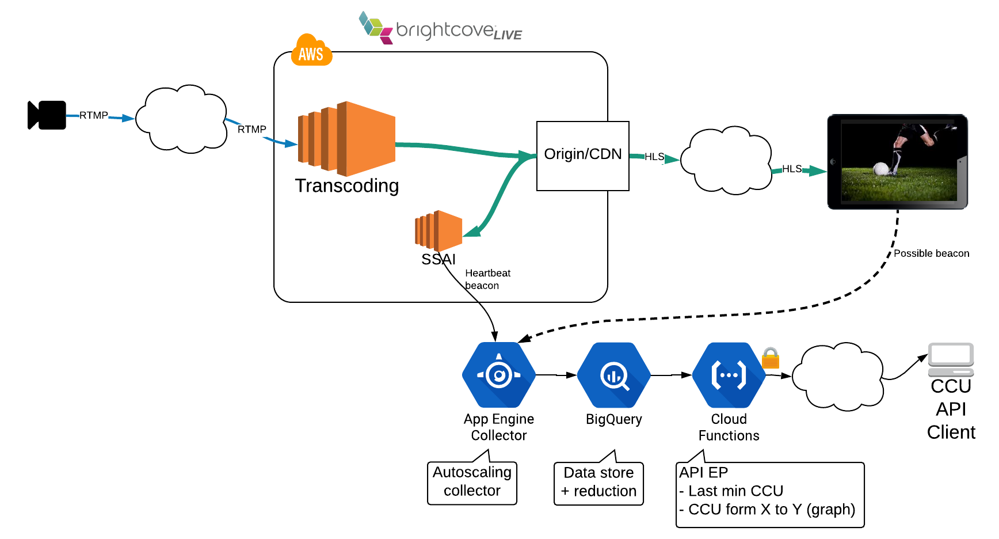

# brighcove-live-ssai-ccu
This project is just a POC (proof of concept) to show a possible way to calculate the real time CCU (concurrent viewers) for any Brightcove live stream with SSAI (Server Side Ad Insertion) active.
But could also be used player side with implementing a simple video-js plug-in, and then it will work for any stream from any platform
This system autoscales in the collectors side, and keep the data in BigQuery as small as possible.

IMPORTANT NOTE: This project is creating resources on the user's GCP (Google Cloud Platform), if you measure CCU of high audiences streams you can incur in high GCP costs. Please see [Next steps](#next-steps) section to see several ways to reduce the GCP cost of this solution

# Block diagram

//TODO: Update 


1. The collectors receives the beacons from the filed, those beacons can be sent from the Brightcove live backend (see example in [Deployment](#Deployment)), or from the player (needs some simple code there). Those collectors autoscale pretty quick according to appEngine config (//TODO link)
2. The collectors sends almost instantaneously the beacons to a BigQuery table
3. Every 30s the cloud function `TODO` is called and using BigQuery calculates the CCU data per jobid for last X minutes, aggregating this data in 1 minute slots (resolution). Finally inserts the results to GCP Datastore table
4. Every 1min the cloud function `TODO` is called and removes data older than 1h on the BigQuery beacons table, keeping this table size small

# Deployment
1. Clone this repo:
```
git@github.com:jordicenzano/brighcove-live-ssai-ccu.git
```

2. Copy the config file `cp ./config/config.vars.example cp ./config/config.vars`, and use any text editor to fill out the values in `./config/config.vars`

3. Copy the secrets file `cp ./secrets/secrets.vars.example cp ./secrets/secrets.vars`, and use any text editor to fill out the values in `./secrets/secrets.vars`

4. Execute the GCP deployment script (you will be prompted to answer few questions). We are assuming you already have a GCP account
```
./GCP_deploy.sh
```
3. As a result of the previous script you should write down those 2 values.

Beacons entry point:
```
Deployed service [default] to [https://GCP_PROJECT_NAME.appspot.com]
```

API entry point:
```
httpsTrigger:
  url: https://GCP_CLOUD_FUNCTION_REGION-GCP_PROJECT_NAME.cloudfunctions.net/GCP_CLOUD_FUNCTION_NAME
```

4. Create the following beacon set in Brightcove live. Assuming you already have a Brightcove live account (and API KEY). (Replace GCP_PROJECT_NAME )
```
curl -X POST \
  https://api.bcovlive.io/v1/ssai/beaconsets \
  -H 'Content-Type: application/json' \
  -H 'x-api-key: YOUR_API_KEY' \
  -d '{
    "beacon_urls": [{
        "beacon_url": "https://GCP_PROJECT_NAME.appspot.com/{{random.uuid}}/{{job.job_id}}/{{session.session_id}}/{{account.vc_id}}/{{server.timestamputc}}/heartbeat",
        "beacon_type": "Heartbeat"
    }]
}'
```
White down the `beacon_set_id` param that you will get from the previous request

5. Create a Brightcove live job (replace YOUR_BCOV_API_KEY, BCOV_LIVE_REGION, BCOV_LIVE_SSAI_BEACONSET_ID (from previous request))
```
curl -X POST \
  https://api.bcovlive.io/v1/jobs \
  -H 'Content-Type: application/json' \
  -H 'x-api-key: YOUR_BCOV_API_KEY' \
  -d '{
    "live_stream": true,
    "region": "BCOV_LIVE_REGION",
    "reconnect_time": 300,
    "ad_insertion": true,
    "beacon_set": "BCOV_LIVE_SSAI_BEACONSET_ID",
    "static": false,
    "outputs": [{
        "label": "hls720p",
        "live_stream": true,
        "height": 720,
        "video_bitrate": 2000,
        "segment_seconds": 6,
        "keyframe_interval": 60
   },
   {
        "label": "hls480p",
        "live_stream": true,
        "height": 480,
        "video_bitrate": 700,
        "segment_seconds": 6,
        "keyframe_interval": 60
   }]
}'
```
White down the `job_id` param that you will get from the previous request

6. If you want to know the CCU of the previous job for the last minute you just need to execute (replacing: YOUR_API_SECRET, GCP_CLOUD_FUNCTION_REGION, GCP_PROJECT_NAME, GCP_CLOUD_FUNCTION_NAME, BCOV_LIVE_JOB_ID)
```
curl -v --header "x-api-key: YOUR_API_SECRET" https://GCP_CLOUD_FUNCTION_REGION-GCP_PROJECT_NAME.cloudfunctions.net/GCP_CLOUD_FUNCTION_NAME?jobid=BCOV_LIVE_JOB_ID
```

//TODO: new format
Example response:
```
[[{"CCU":212}]] 
```
It means in the last minute 212 players were requesting video

7. If you want to know the CCU of job (BCOV_LIVE_JOB_ID) for a time range (replacing: YOUR_API_SECRET, GCP_CLOUD_FUNCTION_REGION, GCP_PROJECT_NAME, GCP_CLOUD_FUNCTION_NAME, BCOV_LIVE_JOB_ID)
```
curl -v --header "x-api-key: YOUR_API_SECRET" https://GCP_CLOUD_FUNCTION_REGION-GCP_PROJECT_NAME.cloudfunctions.net/GCP_CLOUD_FUNCTION_NAME?jobid=BCOV_LIVE_JOB_ID\&in\=EPOCH_START\&out\=EPOCH_END
```
Example response:
```
[[{"time":{"value":"2018-07-29T16:09:00.000Z"},"ccu":1},{"time":{"value":"2018-07-29T16:10:00.000Z"},"ccu":1}]]
```
You get one datapoint with the CCU in that minute that are different than 0

# Accuracy
* The Heartbeat beacon is created and queued when any SSAI session requests a chunk, so every target duration (usually between 2 and 15 seconds). This means that a playback session has been created and the player is actively requesting media data.
This beacon is added to the tracking events queue and fired with the rest of tracking events, the AVG time in this queue should be few seconds, but under heavy load it is possible to have longer times then we'll lose accuracy (see [Next steps](#next-steps) to fix that)
* We stablished a 1 minute window to calculate the CCU, our CCU could be defined as: **The number of players that are requesting media chunks during 1 minute**. Since we have NOT found any standard to define the CCU, if you what to increase your CCU without lying you can just increase the window time from 1 min to 1h for example.
* The beacon information in this approach is sent server side, so ad blockers can NOT block these requests. They should be more accurate than player side beaconing

# Next steps
* IMPORTANT, in Brighcove live we could:
  * Prioritize the Heartbeat beacon (or make it synchronous?)
  * (?) Add headers to beacons (to secure the communication beacon - analytics)
  * (?) Add the replacement to SSAI API to send epoch seconds and epoch ms (without decimal point)
* We could develop easy video-js / Brightcove player plug-in and take advantage of the same system to calculate real time CCU
* A good property of this system could be compare server side vs player side beaconing. Could be a good way to measure the number if adblockers for a specific job / customer
* Configure `./collector/app.yaml.base` to autoscale (configure just for testing, low cost)
* Use a new table to store the CCU values per minute & job, that way we only calculate them one (huge cost reduction)
* Use an API cache to do not query the BigQuery for any repeated request (we can crate cache hash based on all GET params)
* Add API capacity to query CCU from - to, then you should get an array of datapoints (one datapoint per minute)
* Use BigQuery partition table to increase efficiency and reduce costs
* Data reduction, for a prod service we should plan a data reduction process, susch as:
  * Every 1h (just in case beacons are delayed) aggregate all CCU per min into a new table (one-min-time-jobid-table)
  * Every 24h aggregate all CCU per min into a new table (ten-min-jobid-tanble)
  * Every 7d aggregate all CCU per ten min into a new table (hour-jobid-tanble)
  * Ans so on... and the older data on those tables should expire
